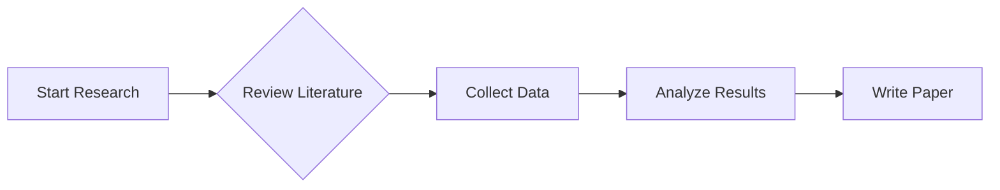

$x = \frac{-b \pm \sqrt{b^2 - 4 a c}}{2a}$

$$x = \frac{-b \pm \sqrt{b^2 - 4 a c}}{2a}$$

$\epsilon$
$\varepsilon$

$$X = \begin{bmatrix} x_{11} & x_{12} \\ 
x_{21} & x_{22} \end{bmatrix}$$

We're meeting on September $29^\mathrm{th}$

